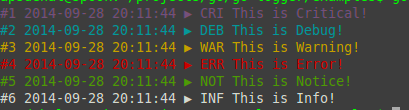

# go-logger

[](https://travis-ci.org/apsdehal/go-logger)
[](http://godoc.org/github.com/apsdehal/go-logger)

A simple go logger for easy logging and debugging of your programs

# Example

Example [program](examples/example.go) demonstrates how to use the logger.

[](examples/example.go)

```go
package main

import (
	"github.com/gjvnq/go-logger"
	"os"
)

func main () {
	// Get the instance for logger class, "test" is the module name, 1 is used to 
	// state if we want coloring 
	// Third option is optional and is instance of type io.Writer, defaults to os.Stderr
	log, err := logger.New("test", 1, os.Stdout)
	if err != nil {
		panic(err) // Check for error
	}

	// Critically log critical
	log.Critical("This is Critical!")
	log.CriticalF("%+v", err)
	// Debug
	log.Debug("This is Debug!")
	log.DebugF("Here are some numbers: %d %d %f", 10, -3, 3.14)
	// Give the Warning
	log.Warning("This is Warning!")
	log.WarningF("This is Warning!")
	// Show the error
	log.Error("This is Error!")
	log.ErrorF("This is Error!")
	// Notice
	log.Notice("This is Notice!")
	log.NoticeF("%s %s", "This", "is Notice!")
	// Show the info
	log.Info("This is Info!")
	log.InfoF("This is %s!", "Info")

	log.StackAsError("Message before printing stack");
}
```

# Install

`go get github.com/apsdehal/go-logger`

Use `go get -u` to update the package.

# Tests

Run `go test logger` to run test on logger
and `go bench` for benchmarks

## Thanks

Thanks goes to all go-loggers out there in github world

## License

The [BSD 3-Clause license][bsd], the same as the [Go language][golang].
[bsd]: http://opensource.org/licenses/BSD-3-Clause
[golang]: http://golang.org/LICENSE
